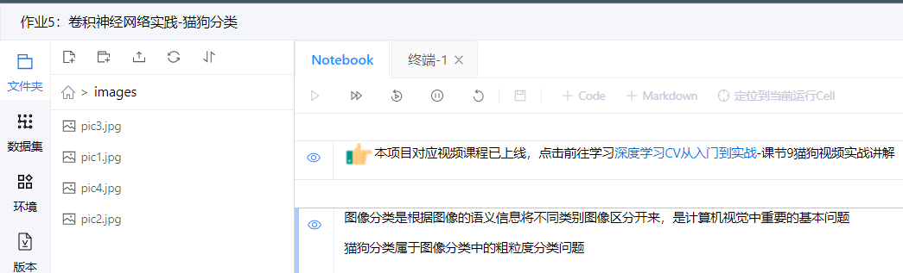
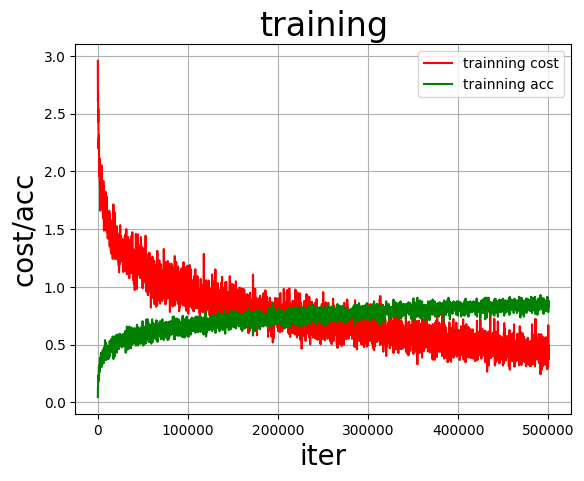
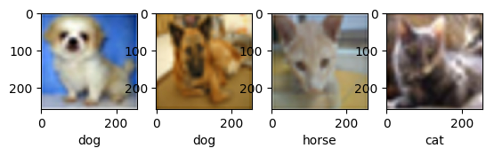

# 机器学习猫狗识别
cat_dog.py是项目文件
6029907.py是paddle网站的备份代码
images是项目图片

## 运行环境

#### 本地环境：

windows10--------python3.8----------paddle

本次工程使用 CPU 训练

conda环境中安装百度飞桨的paddle软件包:

pip install paddlepaddle -i https://pypi.tuna.tsinghua.edu.cn/simple

如果使用GPU,需要安装paddleGPU相关的包

pip install paddlepaddle-gpu -i https://pypi.tuna.tsinghua.edu.cn/simple

#### 远程环境：
百度paddle AI-stdio平台

实现步骤
1. 在paddle中新建images文件夹，上传图片

<left><left>

2. 将 cat_dog.py 是项目文件代码复制到平台环境

3. 运行

## 运行结果

本次预测的四张图片：

<left><left>
<left><left>
<left><left>
<left><left>

实验结果：

<left><left>
        <left><left>